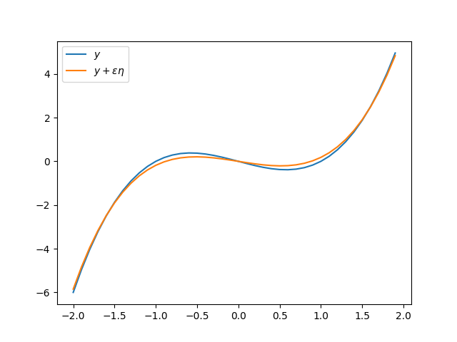

# バイアス・バリアンス分解

観測データの集合 $$\mathcal{D}_N=\{(\boldsymbol{x}_n,y_n)\, |\, n=1,2,\dots,N\}$$ から学習されたモデルにおいて, 新しいデータ $$\boldsymbol{x}$$ に対して $$y$$ の予測する予測値
$$y(\boldsymbol{x})$$ の真の値 $$y_t$$ のズレを損失という. ここではズレの指標として二乗誤差 $$\mathcal{L}(y(\boldsymbol{x}))=(y(\boldsymbol{x})-y_t)^2$$ について考える. これは $$y$$ についての汎関数になっている. $$p(\boldsymbol{x},y_t)$$ を $$\boldsymbol{x}$$ と $$y_t$$ の同時分布とおく. 損失函数の期待値は次で与えられる.

$$
\mathbb{E}[\mathcal{L}(y)]=\iint (y(\boldsymbol{x})-y_t)^2p(\boldsymbol{x},y_t)\, dy_td\boldsymbol{x}
$$

定義により様々な $$\boldsymbol{x}$$ を観測した際の $$y(\boldsymbol{x})$$ と $$y_t$$ のズレの平均を表している.

## ズレを最小にする函数
このズレを最小にする $$y=y(\boldsymbol{x})$$ は次のように書ける:

$$
\underset{y}{\mathrm{argmax}}\, \mathbb{E}[\mathcal{L}(y)] = \mathbb{E}[y_t|\boldsymbol{x}] = \int y_t p(y_t|\boldsymbol{x})dy_t
$$

証明

いま, $$y: \boldsymbol{x} \mapsto y(\boldsymbol{x})$$ が $$E[\mathcal{L}(y)]$$ を最小にするものとする. この $$y$$ に良い条件を持つ (e.g. 十分滑らかな) テスト函数 $$\eta$$ をわずかに付与, すなわち十分に小さい $$\varepsilon$$ を用いて $$y+\varepsilon\eta$$, なるものを考える. このとき

$$
\lim_{\varepsilon\to 0} \frac{\mathbb{E}[\mathcal{L}(y+\varepsilon\eta)]-\mathbb{E}[\mathcal{L}(y)]}{\varepsilon}= \left.\frac{\partial}{\partial\varepsilon}\mathbb{E}[\mathcal{L}(y+\varepsilon\eta)]\right|_{\varepsilon=0}= 0
$$

を要請する (平たくいうと汎関数 $$\mathbb{E}[\mathcal{L}(\cdot)]$$ の極値).

二乗損失の場合は次のように極値をとる $$y$$ を計算する:

$$
\begin{align}
\left.\frac{\partial}{\partial\varepsilon}\mathbb{E}[\mathcal{L}(y+\varepsilon\eta)]\right|_{\varepsilon=0}
&=
\left.\iint \frac{\partial}{\partial \varepsilon}(y+\varepsilon\eta-y_t)^2p(\boldsymbol{x},y_t)\, dy_td\boldsymbol{x}\right|_{\varepsilon=0}\\
&=
\left.\iint 2\eta(\boldsymbol{x})(y+\varepsilon\eta-y_t)p(\boldsymbol{x},y_t)dy_td\boldsymbol{x}\right|_{\varepsilon=0}\\
&=
2\int\left(\int (y(\boldsymbol{x})-y_t)p(\boldsymbol{x},y_t)dy_t\right) \eta(\boldsymbol{x})d\boldsymbol{x}
\end{align}
$$

これが任意の $$\eta(\boldsymbol{x})$$ について 0 を要請すると

$$
\int (y(\boldsymbol{x})-y_t)p(\boldsymbol{x},y_t)dy_t=0 \quad \mathrm{for\ all\ } \boldsymbol{x}
$$

よって

$$
y(x)p(\boldsymbol{x}) = y(\boldsymbol{x})\int p(x,y_t)dy_t = \int y_tp(\boldsymbol{x},y_t)dy_t
$$

ゆえに

$$
y(\boldsymbol{x}) = \int y_t \frac{p(\boldsymbol{x},y_t)}{p(\boldsymbol{x})} dy_t = \int y_t p(y_t|\boldsymbol{x})dy_t = \mathbb{E}[y_t|\boldsymbol{x}].
$$

## 理想からの乖離

上記の議論から $$\mathbb{E}[y_t|\boldsymbol{x}]$$ がズレをもっとも最小にする理想な函数である. 学習によって得られた $$y(\boldsymbol{x})$$ に関しての $$\mathbb{E}[\mathcal{L}(y)]$$ を次のように分解できる:

$$
\begin{align}
\mathbb{E}[\mathcal{L}]
&=
\int (y-y_t)^2p(\boldsymbol{x},y_t)dy_td\boldsymbol{x}\\
&=
\int (y(\boldsymbol{x})-\mathbb{E}[y_t|\boldsymbol{x}])^2 p(\boldsymbol{x}) d\boldsymbol{x}+
\iint (\mathbb{E}[y_t|\boldsymbol{x}]-y_t)^2 p(\boldsymbol{x},y_t)dy_td\boldsymbol{x}.
\end{align}
$$

証明

損失函数を $$E[y_t|\boldsymbol{x}]$$ を介して分解する.

$$
\begin{align}
\mathcal{L}(y)
&=
(y(\boldsymbol{x})-y_t)^2 \\
&=
(y(\boldsymbol{x})-\mathbb{E}[y_t|\mathbb{x}]+\mathbb{E}[y_t|\boldsymbol{x}]-y_t)^2 \\
&=
(y(\boldsymbol{x})-\mathbb{E}[y_t|\mathbb{x}])^2 +
2(y(\boldsymbol{x})-\mathbb{E}[y_t|\boldsymbol{x}])(\mathbb{E}[y_t|\boldsymbol{x}]-y_t)
+(\mathbb{E}[y_t|\boldsymbol{x}]-y_t)^2
\end{align}
$$

このとき

$$
\iint (y(\boldsymbol{x})-\mathbb{E}[y_t|\boldsymbol{x}])(\mathbb{E}[y_t|\boldsymbol{x}]-y_t)p(\boldsymbol{x},y_t) dy_td\boldsymbol{x}=0
$$

がわかる.実際,

$$
\begin{align}
\iint
(y(\boldsymbol{x})-\mathbb{E}[y_t|\boldsymbol{x}])(\mathbb{E}[y_t|\boldsymbol{x}]-y_t)
p(\boldsymbol{x},y_t)
dy_td\boldsymbol{x}
&=
\int (y(\boldsymbol{x})-\mathbb{E}[y_t|\boldsymbol{x}])
\left(\int
(\mathbb{E}[y_t|\boldsymbol{x}]-y_t)p(\boldsymbol{x},y_t)
dy_t\right)
d\boldsymbol{x}.
\end{align}
$$

特に

$$
\begin{align}
\int (\mathbb{E}[y_t|\boldsymbol{x}]-y_t)p(\boldsymbol{x},y_t)dy_t
&=
\mathbb{E}[y_t|\boldsymbol{x}]\int p(\boldsymbol{x},y_t)dy_t - p(\boldsymbol{x})\int y_t \frac{p(\boldsymbol{x},y_t)}{p(\boldsymbol{x})}dy_t \\
&=
\mathbb{E}[y_t|\boldsymbol{x}]p(\boldsymbol{x}) - p(\boldsymbol{x})\mathbb{E}[y_t|\boldsymbol{x}]
=0
\end{align}
$$

これと

$$
\begin{align}
\iint (y(\boldsymbol{x})-\mathbb{E}[y_t|\boldsymbol{x}]) p(x,y_t) dy_td\boldsymbol{x}
&=
\int (y(\boldsymbol{x})-\mathbb{E}[y_t|\boldsymbol{x}])\left(\int p(x,y_t) dy_t\right)d\boldsymbol{x}\\
&=
\int (y(\boldsymbol{x})-\mathbb{E}[y_t|\boldsymbol{x}])^2 p(\boldsymbol{x}) d\boldsymbol{x}.
\end{align}
$$

から示したいことが示される.

# データごとに定まるモデルに関する期待値

$$
\mathbb{E}[\mathcal{L(y)}]=
\int (y(\boldsymbol{x})-\mathbb{E}[y_t|\boldsymbol{x}])^2 p(\boldsymbol{x}) d\boldsymbol{x}+
\iint (\mathbb{E}[y_t|\boldsymbol{x}]-y_t)^2 p(\boldsymbol{x},y_t)dy_td\boldsymbol{x}.
$$

まで分解できた.

ところで, モデルの特性は(アルゴリズムを一つ固定した場合), データによって決まる. 以下データ $$\mathcal{D}$$ をパラメータとして $$y=y(\boldsymbol{x}; \mathcal{D})$$ と明示する. $$D$$ に対してモデル $$y(\cdot;\mathcal{D})$$ を求め, それの平均を $$\mathbb{E}[y(\cdot;\mathcal{D})]$$ と置く.このとき二乗誤差を次のように変形する:

$$
\begin{align}
(y(\boldsymbol{x})-\mathbb{E}[y_t|\boldsymbol{x}])^2
&=
(y(\boldsymbol{x})-\mathbb{E}_\mathcal{D}[y(\boldsymbol{x};\mathcal{D})]+\mathbb{E}_\mathcal{D}[y(\boldsymbol{x};\mathcal{D})]-\mathbb{E}[y_t|\boldsymbol{x}])^2\\
&=
(y(\boldsymbol{x})-\mathbb{E}_\mathcal{D}[y(\boldsymbol{x};\mathcal{D})])^2
+
2(y(\boldsymbol{x})-\mathbb{E}_\mathcal{D}[y(\boldsymbol{x};\mathcal{D})])(\mathbb{E}_\mathcal{D}[y(\boldsymbol{x};\mathcal{D})]-\mathbb{E}[y_t|\boldsymbol{x}])
+(\mathbb{E}_\mathcal{D}[y(\boldsymbol{x};\mathcal{D})]-\mathbb{E}[y_t|\boldsymbol{x}])^2.
\end{align}
$$

第二項に関して $$\mathbb{E}_\mathcal{D}[\cdot]$$ を計算すると

$$
\begin{align}
\mathbb{E}_\mathcal{D}[(y(\boldsymbol{x})-\mathbb{E}_\mathcal{D}[y(\boldsymbol{x};\mathcal{D})])(\mathbb{E}_\mathcal{D}[y(\boldsymbol{x};\mathcal{D})]-\mathbb{E}[y_t|\boldsymbol{x}])]
&=
\mathbb{E}_\mathcal{D}[y(\boldsymbol{x};\mathcal{D})-\mathbb{E}_\mathcal{D}[y(\boldsymbol{x};\mathcal{D})]](\mathbb{E}_\mathcal{D}[y(\boldsymbol{x};\mathcal{D}]-\mathbb{E}[y_t|\boldsymbol{x}])\\
&=
\underset{=0}{\underbrace{(\mathbb{E}_\mathcal{D}[y(\boldsymbol{x};\mathcal{D})]-\mathbb{E}_\mathcal{D}[y(\boldsymbol{x};\mathcal{D})])}}(\mathbb{E}_\mathcal{D}[y(\boldsymbol{x};\mathcal{D}]-\mathbb{E}[y_t|\boldsymbol{x}])
=0
\end{align}
$$

よって

$$
\mathbb{E}_\mathcal{D}[(y(\boldsymbol{x};\mathcal{D})-\mathbb{E}[y_t|\boldsymbol{x}])^2]
=
\mathbb{E}_\mathcal{D}[(y(\boldsymbol{x})-\mathbb{E}_\mathcal{D}[y(\boldsymbol{x};\mathcal{D})])^2]+
\mathbb{E}_\mathcal{D}[(\mathbb{E}_\mathcal{D}[y(\boldsymbol{x};\mathcal{D})]-\mathbb{E}[y_t|\boldsymbol{x}])^2]
$$

となる. 第１項目を二乗バイアス、２項目
をバリアンスという。
